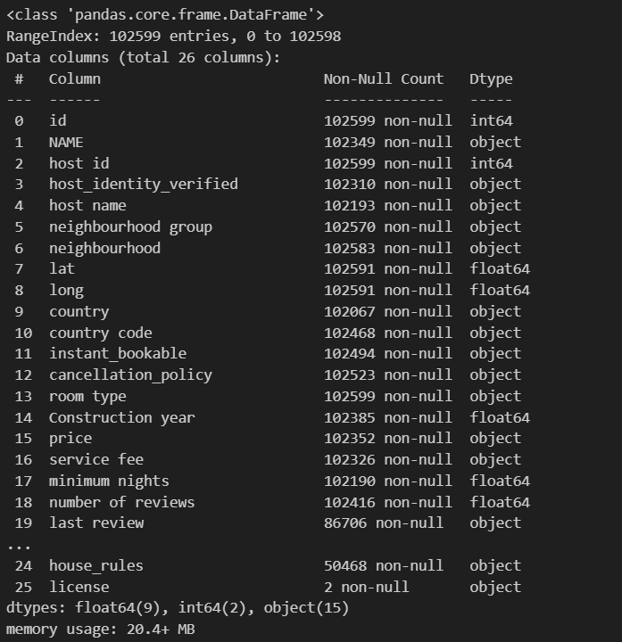
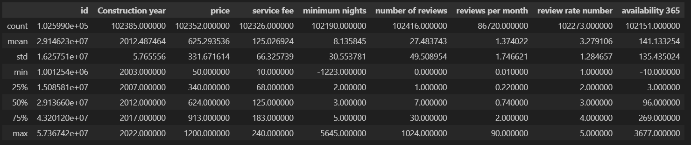

# 팀명 : 똥강아지들의 우당탕당 숙소 데이터 분석

# 🫡팀원 소개
| 이현대 | 신진슬 | 전유빈 | 나지윤 |
|--------|--------|--------|-------|
|  |  |  |  |


# 📅 개발기간
2025.03.10 ~ 2025.03.13 (3일)

# 주제 : 🏡 에어비앤비 데이터 분석을 통해 최적의 숙소 선택 인사이트

##  주제 선정 이유

<figure  style="text-align: center;">

<figcaption>가격과 리뷰 수의 관계 산점도</figcaption>
</figure>


첨부된 기사에 따르면 많은 여행객들은 **가성비 좋은 숙소를 찾기 위해 리뷰와 가격을 꼼꼼히 비교**합니다.  
그러나 방대한 숙소 정보 속에서 **어떤 숙소를 선택해야 할지 판단하는 것은 쉽지 않은 일**입니다.
따라서 우리가 얻을 수 있는 데이터중 뉴욕주의 숙박 데이터를 통해 인사이트를 연역적 접근 (Deductive Approach)을 통해 도춣해 보고자 합니다.

📊 **데이터를 활용하면 객관적인 기준으로 최적의 숙소를 선택할 수 있습니다.**  
이를 통해 **소비자는 자신의 요구와 예산에 맞는 숙소를 쉽게 찾을 수 있으며, 호스트들도 경쟁력을 높이기 위한 전략을 수립할 수 있습니다.**  

🔗 관련 기사:
- [가성비 럭셔리 여행 기사](https://www.traveldaily.co.kr/news/articleView.html?idxno=52838)
- [가성비 여행 가이드 기사](https://www.sukbakmagazine.com/news/articleView.html?idxno=61073)

---

## 📂 분석에 사용한 데이터셋


**데이터 출처:** [뉴욕 에어비앤비 Open Data](https://www.kaggle.com/datasets/arianazmoudeh/airbnbopendata)  
**데이터 내용:** 뉴욕의 에어비앤비 숙소 정보, 가격, 리뷰 수, 예약 가능 일수 등

## 기술 스택
### 데이터 시각화

 ||||


## 🔍 DataSet을 통해 얻고자 하는 인사이트

1️. **소비자의 입장에서 숙소 예약에 참고할 수 있는 인사이트 도출**  
   - 리뷰 수와 숙소 유형 간의 관계를 분석하여, 신뢰할 수 있는 숙소를 찾는 방법 탐색  
   - 최소 숙박일 제한이 있는 숙소 유형 분석  

2️. **숙소 유형(room type)과 지역을 바탕으로 평균 가격 비교**  
   - 도시별 숙소 가격 히트맵을 생성하여, **어떤 지역이 가성비 숙소를 제공하는지 분석**  

3️. **평점과 예약율(연중 예약 가능 일수를 바탕으로 예약율 전처리) 간의 상관 관계 분석**  
   - 예약 가능 일수가 숙소의 선호도를 반영하는지 검토  

4️. **에어비앤비 숙소 선호도 및 예약에 영향을 주는 요소 분석**  
   - 사람들이 어떤 요소를 기준으로 숙소를 예약하는지 탐색  
   - 예약 가능일과 숙소 평점 간의 관계 분석  

---


# 데이터셋 Info
| 속성 | 설명 | 데이터 타입 |
| --- | --- | --- |
| id | 숙소 고유 ID | int64 |
| NAME | 숙소 이름 | object |
| host id | 호스트 ID | int64 |
| host_identity_verified | 호스트의 신원 인증 여부 | object |
| host name | 호스트 이름 | object |
| neighbourhood group | 숙소가 위치한 대략적인 구역(도시나 큰 행정구역) | object |
| neighbourhood | 숙소가 위치한 동네 (구,동 단위) | object |
| lat | 위도 | float64 |
| long | 경도 | float64 |
| country | 숙소가 위치한 국가 | object |
| country code | 국가 코드 | object |
| instant_bookable | 즉시 예약 가능 여부 | object |
| cancellation_policy | 취소 정책 | object |
| room type | 숙소 유형 | object |
| Construction year | 건축 연도 | float64 |
| price | 1박당 숙박 요금(달러) | object |
| service fee | 서비스 이용 수수료 | object |
| minimum nights | 최소 숙박 가능 일수 | float64 |
| number of reviews | 리뷰 수 | float64 |
| last review | 마지막으로 리뷰가 작성된 날짜 | object |
| reviews per month | 월별 평균 리뷰 수 | float64 |
| review rate number | 리뷰 평점(별점) | float64 |
| calculated host listings count | 해당 호스트가 운영하는 숙소 개수 | float64 |
| availability 365 | 1년(365일) 중 숙소 예약 가능 일수 | float64 |
| house_rules | 숙소 이용 규칙 | object |
| license | 숙소의 공식 라이선스(허가) 여부 | object |


# EDA 절차

##  **데이터 로드** 
```
airbnb_df = pd.read_csv('./data/Airbnb_Open_Data.csv',low_memory=False)
```

## 데이터 구조 기초 통계 확인
- 데이터 프레임 정보
<figure  style="text-align: center;">

<figcaption>데이터 프레임 정보</figcaption>
</figure>

- 기본 통계 정보
<figure  style="text-align: center;">

<figcaption>이상치 확인 데이터</figcaption>
</figure>


## 결측치 및 이상치 탐색

    
1. **결측치 탐색**

<figure  style="text-align: center;">

<figcaption>결측치 탐색</figcaption>
</figure>

1. **불필요한 column 제거**
    ```
        host_name
        country
        country_code
        calculated host listings count
        license
        house_rules
        last review
        instant_bookable
        long
        lat
        NAME
        host id
        host_identity_verified
        host name
    ```
- 결측치 제거
    ```
    cancellation_policy
    neighbourhood 
    neighbourhood group
    Construction year
    availability 365
    ```
- 결측치 치환
    ```
    minimum nights
    number of reviews 
    service fee
    price
    reviews per month
    number of reviews
    review rate number
    availability 365
    ```
- 이상치 탐색
    ```
    minimum nights
    number of reviews
    price
    service fee
    reviews per month
    number of reviews
    review rate number
    availability 365
    ```
# 데이터 시각화를 통한 탐색

## 숙소 선호 상관 관계 히트맵
<figure style="display: flex; justify-content: center; gap: 20px; text-align: center; flex-wrap: wrap;">
  <div style="flex: 1; max-width: 50%;">
    
    <figcaption>숙소 선호 상관 관계</figcaption>
  </div>

  <div style="flex: 1; max-width: 50%;">
    
    <figcaption>예약에 영향을 주는 상관관계</figcaption>
  </div>
</figure>


<figure  style="text-align: center;">

<figcaption>가격과 리뷰 수의 관계 산점도</figcaption>
</figure>


## 데이터 정제 및 전처리
### • 결측치 치환
```python
def fillna(df,columns,default=0):
    for column in columns:
        df[column] = df[column].fillna(default)
    return df
```
### • 결측치 제거
```python
def dropna(df,column_list):
    df = df.dropna(subset=column_list,axis=0)
    return df
```
### • 데이터 타입 변환
```python
def change_type(df,columns,type):
    for column in columns:
        df[column] = df[column].astype(type)
    return df
```
### • 이상치 제거
```python
def cleaned_data(df: pd.DataFrame, columns: List[str], value: Union[int, float, List[Union[int, float]]], compare_type: str) -> pd.DataFrame:
    if not columns:
        raise ValueError("컬럼 리스트가 비어있습니다.")
    
    if compare_type == "over":
        if not isinstance(value, (int, float)):
            raise TypeError("value가 숫자가 아닙니다.")
        for column in columns:
            df = df[df[column] < value]
    elif compare_type == "under":
        if not isinstance(value, (int, float)):
            raise TypeError("value가 숫자가 아닙니다.")
        for column in columns:
            df = df[df[column] > value]
    elif compare_type == "between":
        if not isinstance(value, (list, tuple)) or len(value) != 2:
            raise TypeError("value가 리스트 또는 튜플이 아니거나 길이가 2가 아닙니다.")
        lower, upper = value[0], value[1]
        for column in columns:
            df = df[(df[column] > lower) & (df[column] < upper)]
    else:
        raise ValueError(f"Invalid compare_type: {compare_type}. Use 'over', 'under', or 'between'")
    return df
```
### • 함수 활용
```python
# room type 별 평균 가격 계산
room_type_avg_price = airbnb_df.groupby('room type')['price'].mean()
# 데이터 전처리
airbnb_df = fillna(airbnb_df,['price'],airbnb_df['room type'].map(room_type_avg_price))
airbnb_df = fillna(airbnb_df,['minimum nights','availability 365'],1)
airbnb_df = fillna(airbnb_df,['service fee','number of reviews','review rate number'])
airbnb_df = fillna(airbnb_df,['reviews per month'],airbnb_df['review rate number']/12)
airbnb_df = dropna(airbnb_df,['Construction year','neighbourhood group','cancellation_policy'])
# 이상치 제거
airbnb_df = cleaned_data(airbnb_df,['price'],[50,1000],'between')
airbnb_df = cleaned_data(airbnb_df,['availability 365'],[100,365],'between')
airbnb_df = cleaned_data(airbnb_df,['number of reviews'],100,'over')
airbnb_df = cleaned_data(airbnb_df,['minimum nights'],0,'under')
# 타입 변화
airbnb_df = change_type(airbnb_df,['availability 365','number of reviews','Construction year','price','service fee'],int)
airbnb_df['availability 365'] = round((365 - airbnb_df['availability 365']) / 365, 2)
airbnb_df['price'] = airbnb_df['price'] * 1400
airbnb_df['service fee'] = airbnb_df['service fee'] *1400
```

### • 라벨 인코딩
```python
# Label Encoder 초기화
le_neighbourhood = LabelEncoder()
le_cancellation = LabelEncoder()
le_room_type = LabelEncoder()

# 범주형 데이터에 Label Encoding 적용
airbnb_df['neighbourhood group'] = le_neighbourhood.fit_transform(airbnb_df['neighbourhood group'])
airbnb_df['cancellation_policy'] = le_cancellation.fit_transform(airbnb_df['cancellation_policy'])
airbnb_df['room type'] = le_room_type.fit_transform(airbnb_df['room type'])
# 취소 정책의 유연성에 따라 데이터 처리
airbnb_df['cancellation_policy'] = 2 - airbnb_df['cancellation_policy']

```


# 📌 에어비앤비 데이터 분석 결론

우리가 도출하고자 하는 인사이트에 대하여 다음과 같은 결과를 얻을 수 있습니다. 


## 소비자의 입장에서 숙소 예약에 참고할 수 있는 인사이트


- **단기 숙박**의 경우, 일반적으로 **Hotel**을 선택하는 것이 유리합니다.  
  - 일부 숙소는 **최소 숙박일 수 제한 정책**을 운영하여, 일정 박수(n박 이상) 이하로는 예약이 불가능할 수 있습니다.

<figure  style="text-align: center;">

<figcaption>숙박 타입별 최소 숙박 일수</figcaption>
</figure>

- **도시별 평균 리뷰 수를 확인한 결과**, 숙박 후기를 보고 숙소를 선택하는 경우 **Shared room(게스트하우스)를** 제외한 나머지 숙소 유형을 선택하는 것이 좋습니다.

<figure style="display: flex; justify-content: center; gap: 20px; text-align: center; flex-wrap: wrap;">
  <div style="flex: 1; max-width: 50%;">
    
    <figcaption>도시별 평균 리뷰</figcaption>
  </div>

  <div style="flex: 1; max-width: 50%;">
    
    <figcaption>카운티별 평균 리뷰 수</figcaption>
  </div>
</figure>


<figure  style="text-align: center;">

 <figcaption>도시별 리뷰 수</figcaption>
</figure>


<figure  style="text-align: center;">

 <figcaption>숙소 유형별 개수</figcaption>
</figure>

- **건축 연도와 예약률 및 평균 가격 간의 상관관계는 확인되지 않았습니다.**  
  - 이는 **주기적인 리모델링**을 통해 숙박업소가 지속적으로 관리되기 때문으로 추정됩니다.
<figure  style="text-align: center;">

 <figcaption>건축년도에 따른 평균 가격, 예약율, 리뷰수</figcaption>
</figure>


<figure  style="text-align: center;">

 <figcaption>건축년도별 건물 수</figcaption>
</figure>

## 지역 및 숙소 유형별 평균 가격 분석

- **도시별 숙소 타입별 평균 가격 히트맵**을 통해, **어떤 지역에서 더 저렴하게 숙박할 수 있는지 비교 가능**합니다.

<figure  style="text-align: center;">

 <figcaption>지역 및 객실 유형별 평균 가격 히트맵</figcaption>
</figure>


<figure  style="text-align: center;">

 <figcaption>지역구와 숙소 타입에 따른 평균 가격 히트맵</figcaption>
</figure>

<figure  style="text-align: center;">

 <figcaption>Staten Island 제거 후 지역구 & 숙소 타입별 평균 가격 히트맵</figcaption>
</figure>


##  평점과 예약률 간의 상관관계 분석


- 시각화 데이터를 통해서는 **평점과 예약률 간의 뚜렷한 상관관계를 확인할 수 없었습니다.**


<figure  style="text-align: center;">

 <figcaption>숙소 종류별 예약율에 따른 평균 가격</figcaption>
</figure>


## 숙소 선호도 분석 및 예약에 영향을 주는 요소

- **숙소 예약에 영향을 주는 요소를 분석한 결과**, **예약률과 평점 간의 명확한 상관관계를 확인하기 어려웠습니다.**  
- 일반적으로 **인기 있는 숙소일수록 예약 가능일이 적을 가능성이 높습니다.**  
  - 하지만, **예약 가능일(availability_365) 데이터가 신뢰성이 낮아**, 이를 기반으로 한 선호도 분석이 어렵습니다.  
  - 리뷰 평점보다는 **예약 가능일이 적은 숙소를 더 선호하는 경향이 있을 가능성이 큼**.


## ⚠️ 3번과 4번의 인사이트 도출이 어려웠던 이유

###  `availability_365` 데이터의 신뢰성 문제
- `availability_365`는 데이터 수집 시점을 기준으로 **향후 365일 동안 예약 가능한 일수를 나타냅니다.**
- 하지만, **이 값이 실제 예약된 일수만을 반영하는 것이 아니라**, **호스트가 특정 기간 예약을 차단한 경우에도 영향을 받습니다.**  
  - 즉, 숙소 측에서 **미래 예약을 막아둔 경우**, 해당 숙소의 예약 가용율이 실제보다 낮게 기록될 수 있습니다.
- 따라서, **예약 가용율 데이터에 노이즈가 포함되어 있어, 신뢰할 수 없는 데이터 컬럼이 됩니다.**  
  - 이로 인해 **평점과 예약 가능일의 관계(3번) 및 숙소 선호도 분석(4번)을** 정확히 수행하기 어렵습니다.

> 🔗 **[에어비앤비 Open Data 컬럼 설명](https://docs.google.com/spreadsheets/d/1iWCNJcSutYqpULSQHlNyGInUvHg2BoUGoNRIGa6Szc4/edit?gid=1322284596#gid=1322284596)**  
> 해당 문서에서 `availability_365` 컬럼의 정의를 확인할 수 있습니다.

에러 페어

[](https://www.youtube.com/watch?v=bWoW2wectB0)
